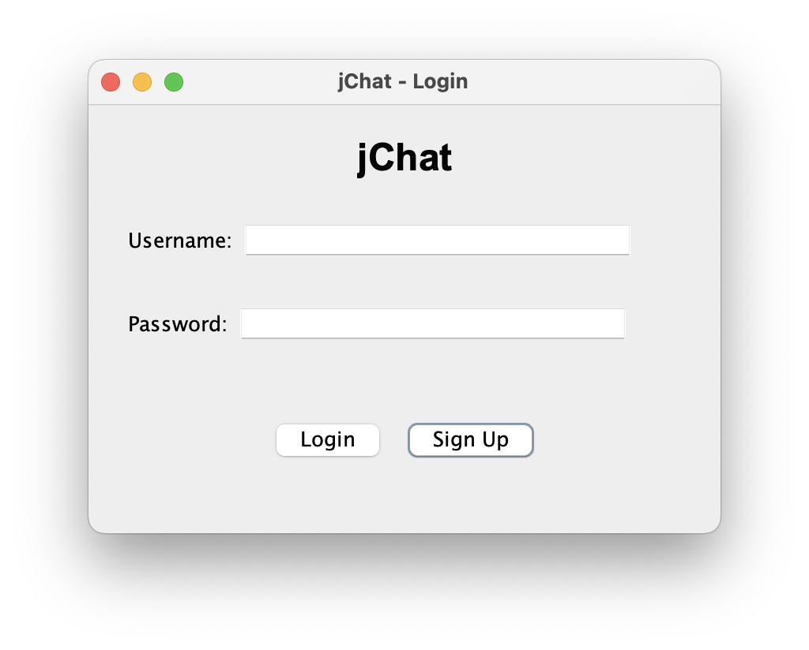
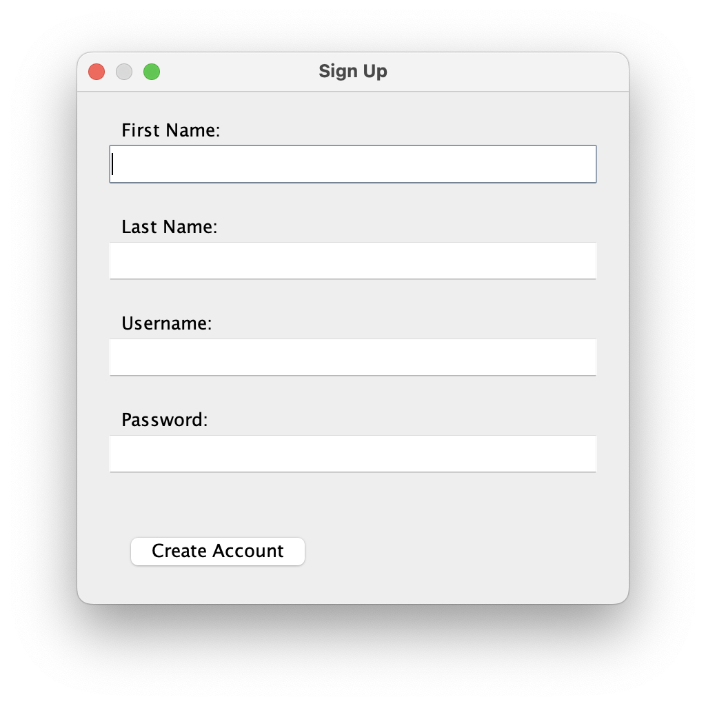
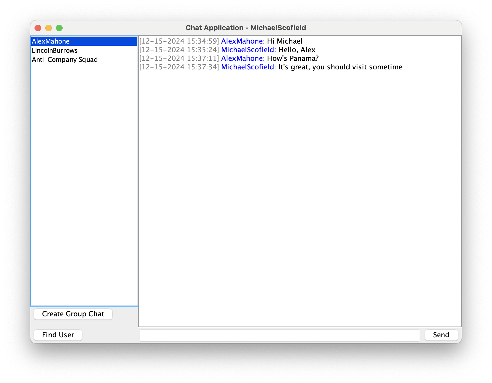
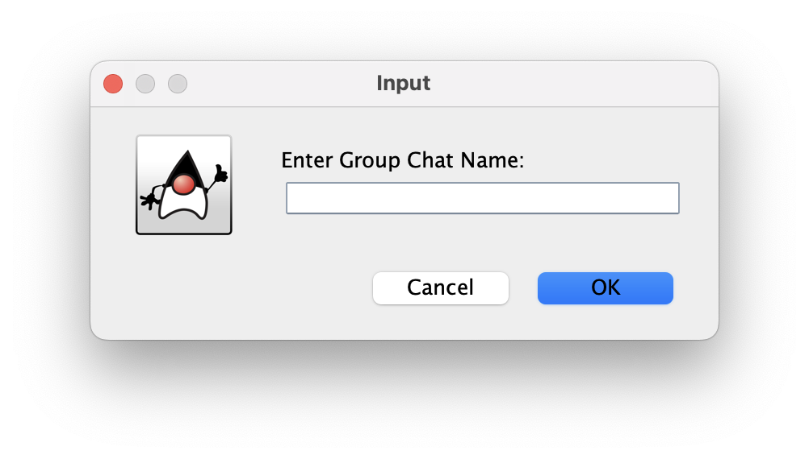
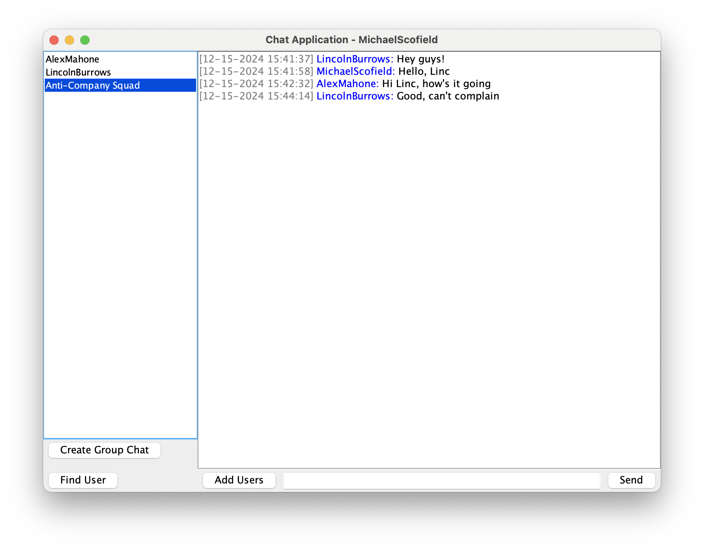

# JChat

**JChat** is a Java-based real-time chat application that supports both private and group messaging. Designed for seamless communication, it allows users to send and receive messages in real-time, with chat history persisted in a relational database for future retrieval.

---

## Table of Contents

1. [Features](#features)
2. [Technologies Used](#technologies-used)
3. [Setup Instructions](#setup-instructions)
4. [Running the Application](#running-the-application)
5. [Screenshots](#screenshots)
6. [Contributors](#contributors)

---

1. **User Authentication**

   Secure login and registration for users.

2. **Private and Group Chats**

   Users can create and participate in private chats or group conversations.

3. **Message Persistence**

   All chat messages (private and group) are stored in a relational database, ensuring users can retrieve their previous chat history.

4. **Real-Time Communication**

   Built using Java Sockets to enable instant messaging.

5. **GUI Design**
   Intuitive user interface built with Java Swing, including:
   - Login and Registration screens
   - Main chat window with options to view, create, and join private/group chat rooms

---

## Technologies Used

- **Java Sockets** (Real-time Communication)
- **Java Swing** (Graphical User Interface)
- **Multithreading** (Server and Client Handling)
- **JDBC** (Database Connection)
- **SQLite3** (Relational Database for Message Persistence)

---

## Setup Instructions

### Prerequisites

Ensure the following are installed on your system:

- **Java Development Kit (JDK)**: 8 or higher
- **SQLite3**: For database management

---

### Installation

1. **Sqlite Setup**
    - In Eclipse, right-click on the project and select "Properties".
    - Select "Java Build Path" from the sidebar menu and then select the "Libraries" tab on top.
    - If you see the sqlite jar already present, it is already configured and you can move on to the next step.
      Otherwise, Click on the "Add JARs" button and then select the ```sqlite-jdbc-3.34.0.jar``` jar file.
    - Apply and close.
   
3. **Database Initialization**  
    Run the shell script to set up the SQLite3 database:

   ```bash
   chmod +x db_init.sh
   ./db_init.sh
   ```

   This script creates the jChat.db database with the necessary tables:
   users, conversations, user_conversations, and messages.

4. **Server Setup**
   Start the server by running `StartServer.java` present inside the src directory in Eclipse.

5. **Client Setup**
   Start clients by running `StartClient.java` present inside the src directory in Eclipse.

6. **Connect Clients**
   - Run multiple instances of StartClient to simulate multiple users.
   - Use the login or registration screens to authenticate and start chatting.

---

## Running the Application

1. Run the `db_init.sh` script to initialize the database.
2. Start the server (`StartServer.java`).
3. Launch one or more client instances (`StartClient.java`).
4. Users can log in, create/join group chats and send messages.

---

## Screenshots

### Login

## 

### Sign Up

## 

### Private Messaging

## 

### Create Group Chats

## 

### Group Messaging

## 

## Contributors

**Siddharth Nitin Bhardwaj (snb8849)**
**Aryaman Rishabh (ar8643)**
